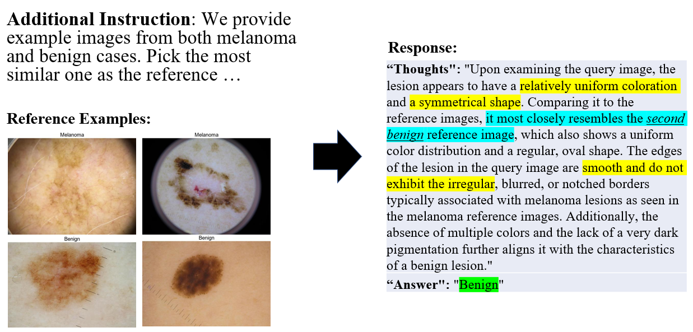

# Dermoscopic Image In-Context Learning (ICL) with GPT4v


## Requirements
1. pandas
2. PIL
3. transformer
4. json
5. scipy
6. openai
7. base64

## Repository Structure:

```
.
├── data                                 # Contains subdirecotories for processed datas
│   ├── all
│   ├── all_resized
│   └── all_resized_label
│   ├── bn
│   ├── bn_resized
│   └── bn_resized_label
│   ├── mm
│   ├── mm_resized
│   └── mm_resized_label
│   └── selected_images.xlsx            # Image names
├── RAW                                 # Contains raw data download from ISCI Archive
├── result                              # Results from running API_calling will be stored here as .json file
│   ├── 1_shot_v3.0_KNN
│   ├── 1_shot_v3.0_Random
│   └── ...
├── API_calling.py                       # Call OpenAI API for classification
├── data_labeling.py                     # Add label to the resized data
├── data_resizing.py                     # Resize the data with original aspect ration
├── data_selection.py                    # Select data from RAW
├── README.md                            
├── result_analysis.py                   # Compute stats for AI generated content
├── result_visualization.ipynb           # Visualize the results
└── topK_finding.py                      # Find the top-k similar images to the query image
```

## Data
All the dermoscopic images are download from [ISIC Archive](https://www.isic-archive.com/)


## ICL with GPT4v


#### General working flow:
1. Download the raw data from ISIC Archive
2. Select data:
   - run *python data_selection.py --[options]*
3. Process data:
   - run *python data_resizeing.py --[options]*
   - run *python data_labeling.py --[options]*
4. Call API:
   - run *python API_calling.py --[options]*
5. Analyze AI response:
   - run *python result_analysis.py --[options]*
6. Visualize the response:
   - run *python result_visualization.ipynb*

## Zero-shot vs Few-shot
GPT4v natually used the "ABCD" rule for dermoscopic image classification.

Domain knowledge didn't applied corretly in the zero-shot learning:


\
Domain knowledge corretly used in the few-shot learning:



## Pick reference example with KNN
The reference image was picked randomly for few-shot learning.
To determine if more representative examples would help GPT4V make the correct decision, we adopted the KNN similarity to find the top K similar images in each category serving as the references.


## Ablation test on color
To determine how the color affects the classification result, we carried out an ablation test on color.


## Results

Few-show learning easily boosts the classification accuracy from around 50% to a 75% level with only 2 or 3 examples.

\

Surprisingly, the KNN didn't help with the accuracy. Our guess is the information provided by the representative samples has been canceled out by each other.

### Impact of different combinations of kNN and random sampling applied to the two reference sets on GPT-4V's dermoscopic classification performance

| **Sampling strategy** | **Performance metrics (%)** | **Sensitivity** | **Specificity** | **Accuracy** |
|-----------------------|-----------------------------|------------------|-----------------|--------------|
| **Melanoma images**   | **Benign images**           |                  |                 |              |
| Random                | Random                      | 59.2±2.6         | 82.8±3.0        | 71.1±1.5     |
| Random                | kNN                         | 54.7±2.0 ↓       | 89.2±4.1 ↑      | 72.1±2.6     |
| kNN                   | Random                      | 76.3±1.0 ↑       | 50.0±1.8 ↓      | 63.0±1.2     |
| kNN                   | kNN                         | 69.4±1.3         | 72.0±3.6        | 70.7±1.4     |

\
As an important pattern used in Skin Cancer diagnosis, color has a significant influence on the results.
