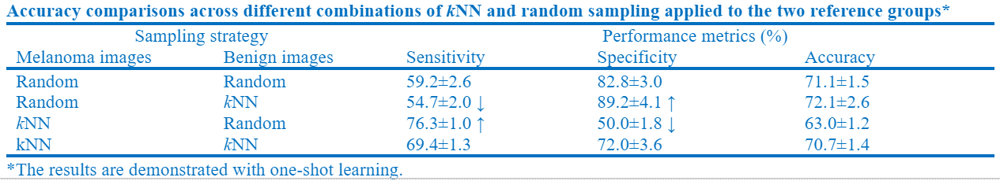

# Dermoscopic Image In-Context Learning (ICL) with GPT4v
[](LICENSE)

This repository contains code and data for performing in-context learning (ICL) on dermoscopic images using GPT-4V. The project aims to classify dermoscopic images as melanoma or benign using few-shot learning techniques.


## Requirements
1. pandas
2. PIL
3. transformer
4. json
5. scipy
6. openai
7. base64

## Repository Structure

```
.
├── data                                 # Contains subdirectories for processed data
│   ├── all
│   ├── all_resized
│   ├── bn
│   ├── bn_resized
│   ├── bn_resized_label
│   ├── mm
│   ├── mm_resized
│   ├── mm_resized_label
│   └── selected_images.xlsx            # Image names
├── RAW                                 # Contains raw data downloaded from ISCI Archive
├── result                              # Results from running API_calling will be stored here as .json files
│   ├── 1_shot_v3.0_KNN
│   ├── 1_shot_v3.0_Random
│   └── ...
├── API_calling.py                       # Call OpenAI API for classification
├── data_labeling.py                     # Add label to the resized data
├── data_resizing.py                     # Resize the data with the original aspect ratio
├── data_selection.py                    # Select data from RAW
├── README.md                            
├── result_analysis.py                   # Compute stats for AI-generated content
├── result_visualization.ipynb           # Visualize the results
└── topK_finding.py                      # Find the top-k similar images to the query image
```

## Data
All the dermoscopic images are downloaded from [ISIC Archive](https://www.isic-archive.com/).


## Disclaimer
This project is for academic research purposes only. The code in this repository is released under the MIT License.
If you use the data provided, please cite the ISIC Archive.
- [](http://creativecommons.org/publicdomain/zero/1.0/)
- [](https://creativecommons.org/licenses/by/4.0/)
- [](https://creativecommons.org/licenses/by/4.0/)

## ICL with GPT4v


#### General working flow:
1. Download the raw data from ISIC Archive
2. Select data:
   - run *python data_selection.py --[options]*
3. Process data:
   - run *python data_resizeing.py --[options]*
   - run *python data_labeling.py --[options]*
4. Call API:
   - run *python API_calling.py --[options]*
5. Analyze AI response:
   - run *python result_analysis.py --[options]*
6. Visualize the response:
   - run *python result_visualization.ipynb*

## Zero-shot vs Few-shot
GPT4v naturally used the "ABCD" rule for dermoscopic image classification.

Domain knowledge didn't apply correctly in the zero-shot learning:


\
Domain knowledge correctly used in the few-shot learning:


## Select reference examples with KNN
The reference image was picked randomly for few-shot learning.
To determine if more representative examples would help GPT4V make the correct decision, we adopted the KNN similarity to find the top K similar images in each category serving as the references.


## Ablation test on color
To determine how the color affects the classification result, we carried out an ablation test on color.


## Results

Few-show learning easily boosts the classification accuracy from around 50% to a 75% level with only 2 or 3 examples.


Surprisingly, the KNN didn't help with the accuracy.\
We explored various combinations of kNN and random sampling applied to the two reference sets, using one-shot learning with random sampling as our baseline for simplicity



As an important pattern used in Skin Cancer diagnosis, color has a significant influence on the results.
